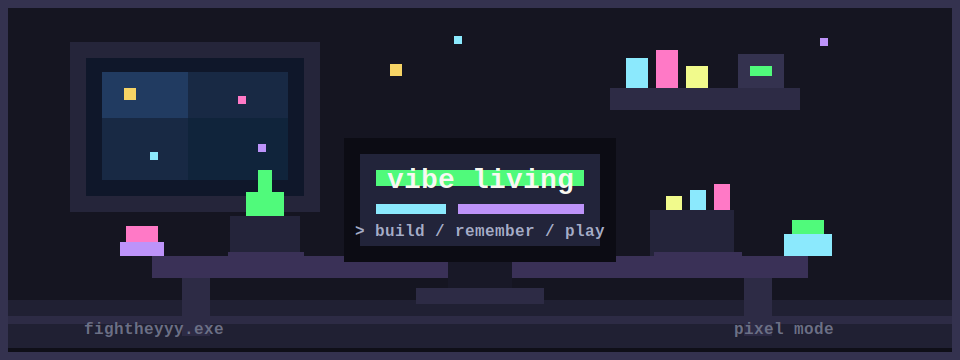

<div align="center">



<h1>fightheyyy</h1>

<p>
  <strong>vibe living</strong><br />
  building small tools, agent workflows, and tiny systems that make work feel lighter.
</p>

<p>
  <a href="https://github.com/fightheyyy/XiaoBa-CLI">XiaoBa-CLI</a>
  /
  <a href="https://github.com/fightheyyy/SuperGoal">SuperGoal</a>
  /
  <a href="https://fightheyyy.github.io">site</a>
</p>

</div>

```txt
+------------------------------------------------------------+
| fightheyyy.exe                                             |
+------------------------------------------------------------+
| status : vibe living                                       |
| mode   : making AI-native tools feel personal and useful   |
| stack  : TypeScript / Python / Swift / R                   |
| focus  : CLI tools / agents / memory / workflow systems    |
+------------------------------------------------------------+
```

### save points

| project | vibe |
| --- | --- |
| [XiaoBa-CLI](https://github.com/fightheyyy/XiaoBa-CLI) | agent-oriented CLI experiments and role workflows |
| [SuperGoal](https://github.com/fightheyyy/SuperGoal) | Codex skills plus a macOS prompt compiler for stable goal-mode development |
| [BioSkills](https://github.com/fightheyyy/BioSkills) | research and bioinformatics-flavored tooling experiments |
| [Mem_System](https://github.com/fightheyyy/Mem_System) | notes, memory, and personal knowledge-system exploration |

### inventory

<p>
  
  
  
  
</p>

### current quest

- designing tools that remember context without getting heavy
- turning rough ideas into usable little systems
- exploring agent workflows, role-based development, and personal automation
- keeping the interface soft, the code sharp, and the vibe alive

```txt
> booting tiny future...
> loading taste...
> done.
```
